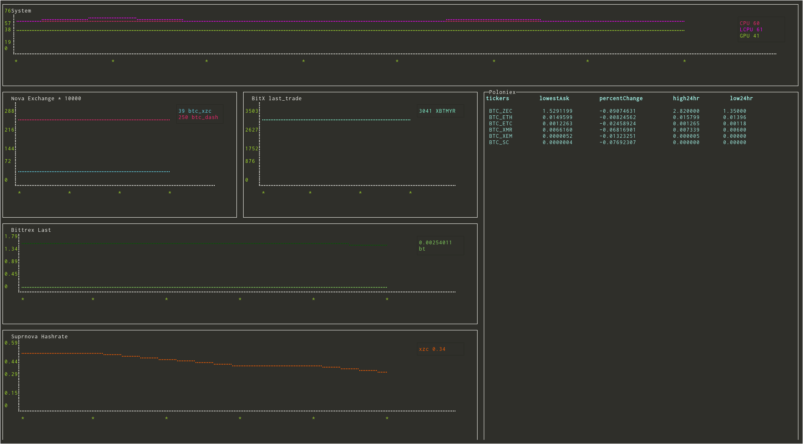

# crypt-monitor (Work in progress..)

A simply configurable cryptocurrency trade & miner monitor application.
[](https://github.com/feross/standard)

# usage
Copy `env.json.example` to `env.json` and configure as necessary. Each JSON key
represents a component. Run `npm install` to install required libraries. Usage:
```
npm start
```

# components
Components are based on [blessed](https://github.com/chjj/blessed/) and [blessed-contrib](https://github.com/yaronn/blessed-contrib/).
All components have `style` and `box` keys which refer back to the containers of these components.
Components are configured in JSON format and have specific keys depending on their requirements.

## SysComponent
Creates a chart based on command output, ideally commands to measure device temperatures.
```
{
    "points": 8,
    "style": ...,
    "box": ...,
    "devices": [
        {
            "name": "CPU", // Device name
            "command": "sensors | grep 'Physical id 0:' | cut -c18-19", // Command that generates numeric output
            "interval": "1", // Refresh interval
            "style": {
                "line": "..."
            }
        },
        ...
    ]
}
```

## NovaExchangeComponent
Retrieves exchange rates for markets and optionally includes a multiplier to make changes more visible.
```
{
    "points": 6,
    "style": ...,
    "box": ...,
    "multiplier": 10000, // Value multiplier
    "markets": [
        {
            "name": "btc_xzc", // Exchange tag
            "interval": 10, // Refresh interval
            "style": {
                "line": "..."
            }
        },
        ...
    ]
}

## 
```

## SuprnovaComponent
Retrieves total hash rate for miners
```
{
    "points": 6,
    "style": ...,
    "box": ...,
    "pools": [
        {
            "name": "xzc", // Mining pool
            "interval": 10, // Refresh interval
            "api_key": "...", // API key from profile
            "style": {
                "line": ...
            }
        }
    ]
}
```

## BitXComponent
BitX latest ticker data
```
{
    "points": 6,
    "style": ...,
    "box": ...,
    "watch": "last_trade", // Value to watch (bid, ask, last_trade, etc)
    "tickers": [
        {
            "name": "XBTMYR", // Ticker code
            "interval": 10, // Refresh interval
            "style": {
                "line": [115, 244, 214]
            }
        },
        ...
    ]
}
```

## BittrexComponent
Bittrex latest ticker data
```
{
    "points": 6,
    "style": ...,
    "box": ...,
    "watch": "Ask", // Value to watch (Bid, Ask, Last)
    "tickers": [
        {
            "name": "btc-xzc", // Ticker code
            "interval": 10, // Refresh interval
            "style": {
                "line": [115, 244, 214]
            }
        },
        ...
    ]
}
```

## PoloniexComponent
Poloniex price data
```
{
    "table": ..., // blessed-contrib table settings
    "interval": 10, // Refresh interval
    "filter": ["BTC_ZEC", "BTC_ETH", "BTC_ETC", "BTC_XMR", "BTC_XEM", "BTC_SC"], // Ticker codes
    "watch": ["lowestAsk", "percentChange", "high24hr", "low24hr"] // Columns to display
}
```

## CoinMarketCap
CoinMarketCap price data
```
{
    "table": ..., // blessed-contrib table settings
    "interval": 10, // Refresh interval
    "filter": ["BTC", "XZC", "ZEC", "DASH", "ETH", "ETC", "XMR", "XEM", "SC"], // Ticker codes
    "watch": ["price_usd", "price_btc", "percent_change_1h"] // Columns to display
}
```

# todo
* Suprnova earnings graph
* Override graphs

# disclaimer
All rights reserved to named companies.
